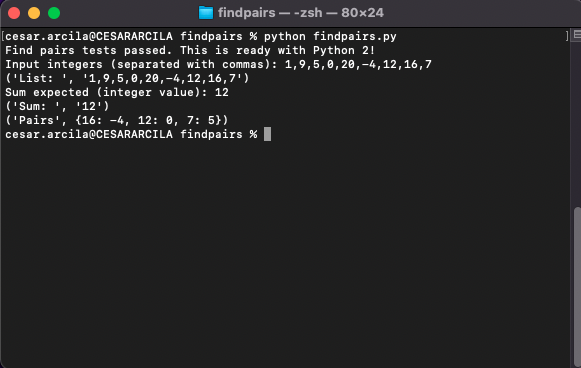
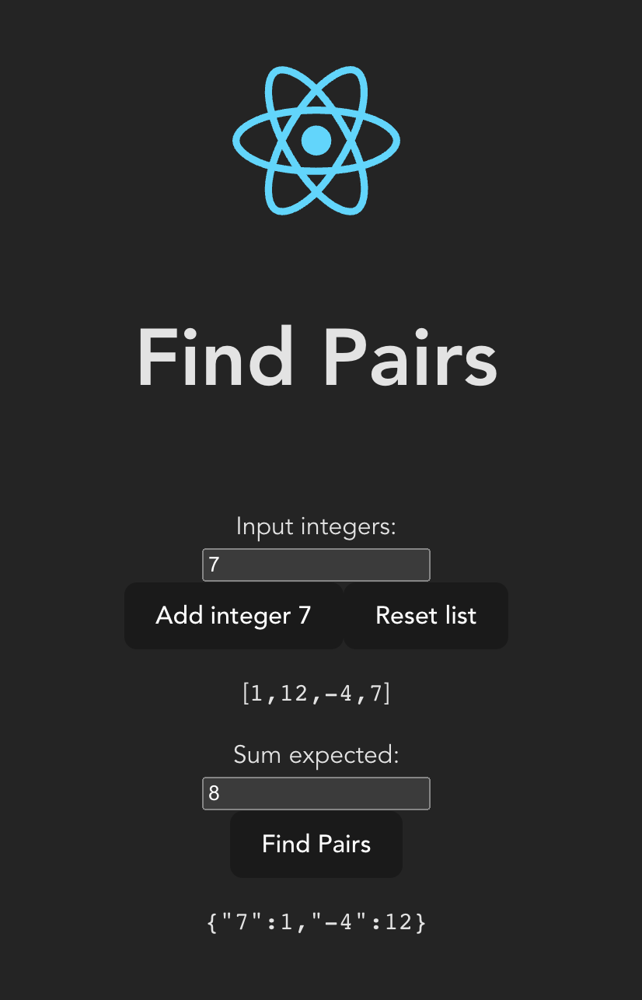
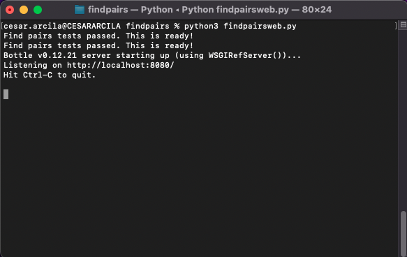

# Find Pairs

This exercise get the find pairs of integers (in a List) given a sum value, just typing `python findpairs.py`.

There are two versions, one is for shell and the other one is for web using **Bottle** library (+**React** App):

- `findpairs.py` is the shell version for **Pyhon 2.7** (because it use `raw_input`). So you can invoke the file just typing `python findpairs.py`
- `findpairsweb.py` is the web (server) version and need to have installed `bottle` and free the `8080` port. Example: `pip3 install bottle` (for Python 3 or you can use Python 2 with `pip`). After this installation you can invoke the file with `python3 findpairsweb.py`
- `findpairsapp/` is the app (front) made in React. You need open this folder in a terminal and execute `npm i` then `npm run dev` (this will open a browser)

> Web version is just a **plus**. It requires **Bootle** installed (i.e. `pip...`) and the service use `localhost:8080`. Then you can launch the **React** App (afert install it with `npm i`) and it will open the browser.

## About the Author - Portfolio

<video class="loader-genially" autoplay="autoplay" loop="loop" playsinline="playsInline" muted="muted" style="position: absolute;top: 45%;left: 50%;transform: translate(-50%, -50%);width: 80px;height: 80px;margin-bottom: 10%"><source src="https://static.genial.ly/resources/panel-loader-low.mp4" type="video/mp4" />Your browser does not support the video tag.</video>

