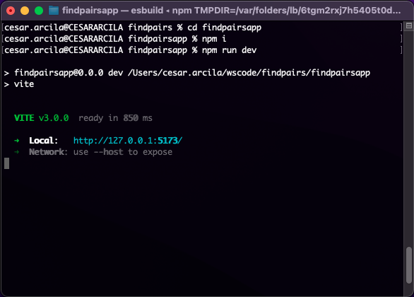

# Find Pairs

This exercise get the find pairs of integers (in a List) given a sum value, just typing `python findpairs.py` from a terminal (there is a web version too).

There are two versions, one is for shell and the other one is for web using **Bottle** library plus a simple **React** App:

- `findpairs.py` is the shell version for **Pyhon 2.7** (because it use `raw_input`). So you can invoke the file just typing `python findpairs.py`

- `findpairsweb.py` is the web (server) version and need to have installed `bottle` and free the `8080` port. Example: `pip3 install bottle` (for Python 3 or you can use Python 2 with `pip`). After this installation you can invoke the file with `python3 findpairsweb.py`

- `findpairsapp/` is the folder for the app (front) made in React and it requires **Node.js** installed. You need open this folder (`cd...`) in a terminal and execute `npm i`, then `npm run dev` (this will show you the local link to open it in a browser)

> Web version is just a **plus**. It requires **Bottle** installed (i.e. `pip...`) and the service use `localhost:8080`. Then you can launch the **React** App (after install it with `npm i`) and it will will show you how see it in a browser.

## About me - Portfolio

https://view.genial.ly/61986aa2181fb40d898b6bfa/presentation-personal-portfolio-en

> Perhaps you want to know about a project I made: [OnMind](https://onmind.co/go/app/land.html)
